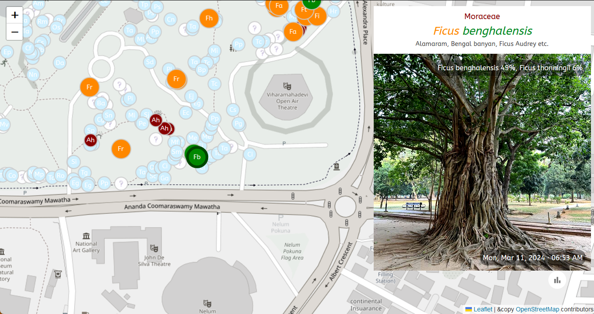

# Plants

App for viewing Plants. 

[https://nuuuwan.github.io/plants](https://nuuuwan.github.io/plants)

Click on the labeled circle to select a plant. The two letter initials are the first letters of the Genus and Species respectively (e.g. Mangifera indica is "Mi").  

* 🟩 Same Species
* 🟧 Same Genus
* 🟥 Same Family
* ⬜ Other Plants

Click on the image to move to a random plant.

## Appendix: [Crown/Tree cover of Viharamahadevi Park, Colombo](https://www.researchgate.net/publication/282250239_CrownTree_cover_of_Viharamahadevi_Park_Colombo) by Madurapperuma & Kuruppu-Arachchi (2015)

>> Recognition of existing landscape designs, suitable tree species and proper maintenance of trees in an urban landscape is beneficial for planning future green spaces in cities. This study examines site-specific tree crown cover and floristic composition in Viharamahadevi Park, Colombo. The tree cover of the area was determined by digitizing over a Google Earth image and the tree cover was compared with estimated crown cover using in-situ data. The vegetation parameters such as diameter-at-breast height (DBH), height, and crown radius were measured in each tree. 

>> The extent of the park is 24.27 ha and the estimated green cover using a Google Earth image is 14.39 ha (59% from the total). The estimated crown cover from the ground survey for the park is 12.25 ha (50%). 

>> A total of 1194 individuals belonging to 89 species, 69 genera and 32 families were recorded in the park premises. The largest contribution of crown cover is given by Tabebuia rosea (2.4%), Terminalia catappa (2.2%), Cassia fistula (2.1%), Mangifera indica (2.0%) and Terminalia arjuna (2%). Considerable numbers of park trees have been replaced by the invasion of Ficus species. 

>> We recommend the following steps for best park management: (i) training the park staff on sustainable park management systems, (ii) appropriate management practices of park trees, such as introducing indigenous trees for gap areas and treatment for disease trees and (iii) facilitating habitat formation and protection of existing habitat for birds and bats. 

>> Keywords: Green Space/ Crown Cover / Floristics /Park

## Appendix: Stats

Mesua ferrea (23), Tecoma stans (18), Terminalia arjuna (15), Mangifera indica (12), Tabernaemontana divaricata (11)